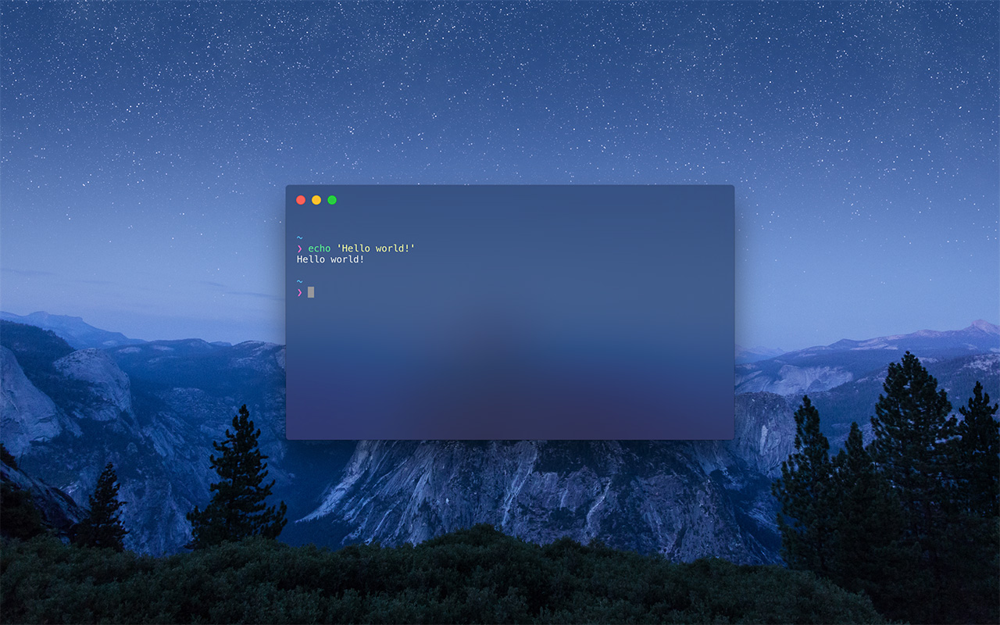

# Hyper-Qing

> An elegant [Hyper](https://hyper.is) theme.



## Install

Add `hyper-qing-theme` to the plugins list in your `~/.hyper.js` config file and restart Hyper:

```
plugins: ['hyper-qing-theme'],
```

## Setting

Now show you something amazing. Add the following code in `~/.hyper.js` **directly after** the colors object:

```
colors: {
    ...
},

QingTheme: {
    // Set background opacity, useful when vibrance is enabled
    // OPTIONS: From 0.1 to 1
    backgroundOpacity: '0.6',

    // Mac Only. Need restart. Enable the vibrance and blurred background
    // OPTIONS: 'dark', 'ultra-dark', 'bright'
    // NOTE: The backgroundOpacity should be between 0.1 and 0.9 to see the effect.
    vibrancy: 'dark'
},
```

Save and restart your Hyper!


